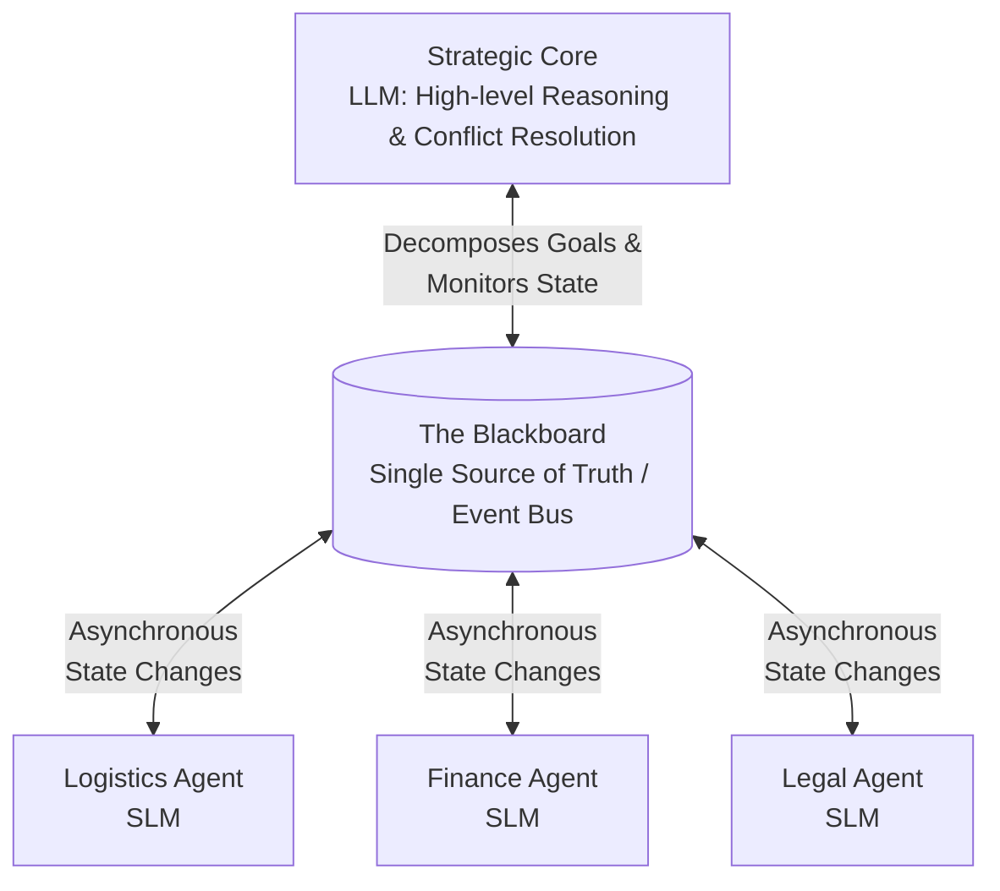
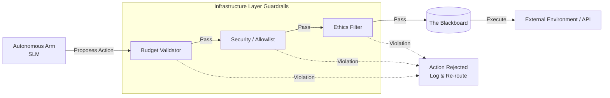
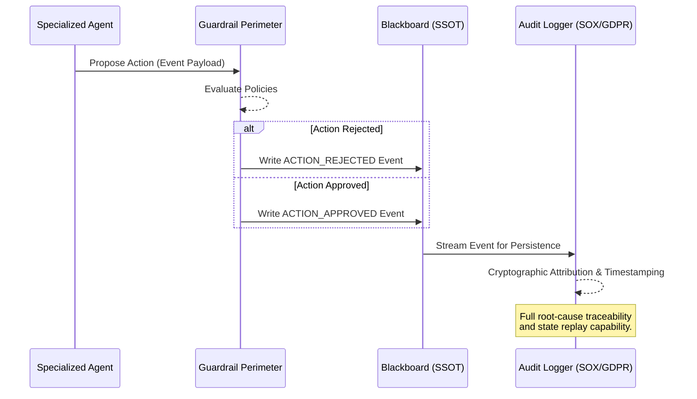

# Octo-Agent 🐙

Building Resilient AI Systems Inspired by Nature.

> "The octopus survived 300 million years of environmental volatility by distributing intelligence without sacrificing coherence."

## The Bottleneck of Centralization
Most enterprise AI deployments suffer from **"Central Brain Syndrome."** Every micro-decision travels to a central LLM, creating latency, high token costs, and a single point of failure. If the "brain" gets confused or overloaded, the whole enterprise stops.

**Octo-Agent** is a decentralized orchestration framework that mirrors cephalopod biology. It distributes tactical execution to specialized SLM (Small Language Model) agents ("Arms") while reserving the heavy LLM ("Brain") exclusively for high-level strategy and conflict resolution.

---

## 1. Architectural Overview: The Cephalopod

Unlike centralized systems, Octo-Agent utilizes a **Blackboard Architecture**—an asynchronous shared state (Single Source of Truth) where agents read and write updates.

### The 5 Evolutionary Principles
1. **Decentralize the Tactical, Centralize the Strategic**: Stop spending expensive "Strategy Tokens" on routine "Tactical Tasks." Routing logic is your highest-leverage design decision.
2. **Blackboard Collaboration**: Replace synchronous chain-of-thought messaging with an asynchronous, append-only state.
3. **Hardwired Digital Instincts (Guardrails)**: Enforce budget, security, and ethics at the infrastructure layer—not just in the prompt.
4. **Day-One Observability**: The Blackboard provides full auditability, root-cause traceability, and compliance evidence.
5. **Reflexive Resilience**: Design for graceful degradation. If an agent fails, the system automatically re-routes tasks.

---

## 2. Guardrail Perimeters (Digital Instincts)

Autonomy without control is chaos. Agents operate within non-negotiable policy boundaries. These are enforced at the infrastructure layer, before any agent output is committed to the Blackboard or executed externally.

A guardrail that lives only in a system prompt can be reasoned around; a guardrail enforced by the execution environment cannot.

---

## 3. Observability & The Audit Trail

In decentralized systems, tracing which agent did what, in which order, and why, is genuinely hard. The Blackboard solves this by acting as the primary observability layer. Every write is structured, timestamped, and attributed.

## Conclusion
The next decade of AI isn't about building bigger brains; it's about building smarter nervous systems. We are moving away from software that we program and toward systems that we orchestrate. 

Build the nervous system first. The intelligence will follow 🧠😎

---
**Developed by Eduardo Arana and Soda 🥤**
